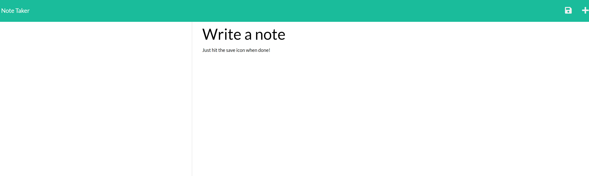

# cuddly-tractor
## About
-- An app that allows the user to write, save, and delete notes.
-- The front end of the project has already been built using HTML, CSS, and Javascript.  Notetaking functionality added through the back end via Node.js and Express.js.
-- To use, click the "Get Started" prompt and type in your note.  Express will save and add the note to an array.
## Contributors
-- Katharine C Humble
## Built With:
-- Node.js
-- Express.js
## View App in Heroku:
https://desolate-garden-30512.herokuapp.com/

